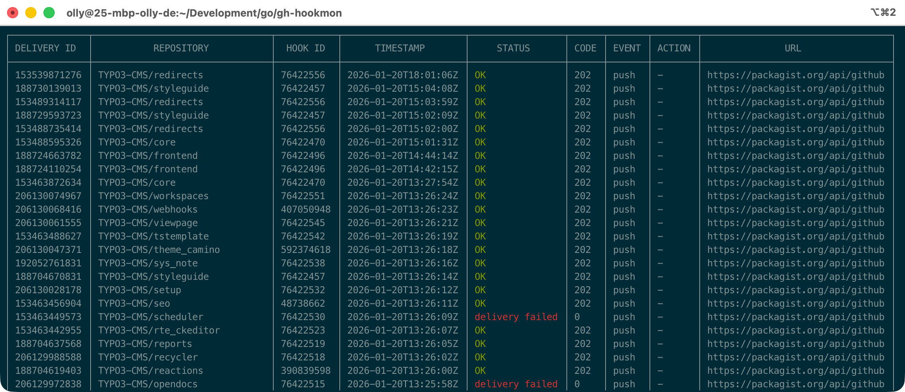

# hookmon - GitHub Webhook Monitor

A GitHub CLI extension for monitoring webhook delivery history across organizations and repositories.

## Features

- List webhook deliveries for organizations or repositories
- Filter deliveries by URL pattern
- Filter deliveries by date range
- Filter for failed deliveries (4xx, 5xx, or no response)
- Limit results to N most recent deliveries per repository
- Sort by repository, timestamp, status code, or event type
- Output in table or JSON format
- Color-coded status display with enhanced error messages
- Automatic pagination for large result sets



## Installation

### As User of GitHub CLI

```bash
gh extension install ohader/gh-hookmon
```

### As Developer

```bash
# Clone the repository
git clone https://github.com/ohader/gh-hookmon.git
cd gh-hookmon

# Build the extension
go build -o gh-hookmon

# Install the extension
gh extension install .
```

### Prerequisites

- [GitHub CLI](https://cli.github.com/) (`gh`) installed and authenticated
- Go 1.21 or later (for building from source)

Authenticate with GitHub CLI if you haven't already:

```bash
gh auth login
```

## Usage

```bash
gh hookmon --help
```

```
Retrieve and display webhook delivery history from GitHub organizations or repositories.

Examples:
  # List all webhook deliveries for an organization
  gh hookmon --org=myorg

  # List webhook deliveries for a specific repository
  gh hookmon --repo=owner/repo

  # Filter by URL pattern
  gh hookmon --org=myorg --filter="slack.com"

  # Filter by date range
  gh hookmon --org=myorg --since=2026-01-01 --until=2026-01-31

  # Show only failed deliveries
  gh hookmon --org=myorg --failed

  # Show only the 5 most recent deliveries per repository
  gh hookmon --org=myorg --head=5

  # Combine filters: failed deliveries from last week, top 3 per repo
  gh hookmon --org=myorg --failed --since=2026-01-13 --head=3

  # Sort by repository name alphabetically
  gh hookmon --org=myorg --sort=repository

  # Sort by status code ascending (success codes first)
  gh hookmon --org=myorg --sort=code:asc

  # Sort by event type descending
  gh hookmon --org=myorg --sort=event:desc

  # Combine with filters and sorting
  gh hookmon --org=myorg --failed --sort=repository:asc --head=5

  # Output as JSON
  gh hookmon --repo=owner/repo --json

Usage:
  gh-hookmon [flags]

Flags:
      --failed          Filter for failed webhook deliveries (4xx, 5xx, or no response)
      --filter string   Filter webhook URLs by pattern
      --head int        Show only N most recent deliveries per repository (default: all)
  -h, --help            help for gh-hookmon
      --json            Output in JSON format
      --last-failed     Filter repos where the most recent delivery failed
      --org string      Process all repos in organization (required if --repo not set)
      --repo string     Process specific repository OWNER/REPO (required if --org not set)
      --since string    Start date YYYY-MM-DD (00:00:00)
      --sort string     Sort by field (repository, timestamp, code, event) with optional order (:asc or :desc)
      --until string    End date YYYY-MM-DD (23:59:59)
  -v, --verbose         Enable verbose output
```

### Basic Commands

List all webhook deliveries for an organization:

```bash
gh hookmon --org=TYPO3-CMS
```

List webhook deliveries for a specific repository:

```bash
gh hookmon --repo=TYPO3-CMS/backend
```

### Filtering Options

#### Filter by URL Pattern

Filter webhooks that contain a specific URL pattern (case-insensitive):

```bash
gh hookmon --org=TYPO3-CMS --filter='https://packagist.org'
```

#### Filter by Date Range

Filter deliveries since a specific date (starts at 00:00:00 UTC):

```bash
gh hookmon --org=TYPO3-CMS --since=2026-01-20
```

Filter deliveries until a specific date (ends at 23:59:59 UTC):

```bash
gh hookmon --repo=TYPO3-CMS/backend --until=2026-01-20
```

Combine both for a specific date range:

```bash
gh hookmon --org=TYPO3-CMS --since=2026-01-01 --until=2026-01-31
```

#### Filter by Failed Deliveries

Show only failed webhook deliveries (HTTP 4xx, 5xx, or status code 0):

```bash
gh hookmon --org=TYPO3-CMS --failed
```

Failed deliveries include:
- HTTP 4xx errors (client errors)
- HTTP 5xx errors (server errors)
- Status code 0 (no response/delivery failed)

### Limiting Results

Show only the N most recent deliveries per repository:

```bash
# Show 5 most recent deliveries per repository
gh hookmon --org=TYPO3-CMS --head=5

# Show 3 most recent deliveries
gh hookmon --repo=TYPO3-CMS/backend --head=3
```

The `--head` flag is applied after all filters, so you get the N most recent matching deliveries.

### Sorting Options

Sort results by different fields with optional order (`:asc` or `:desc`):

#### Sort by Repository Name

```bash
# Alphabetically A-Z (default for repository)
gh hookmon --org=TYPO3-CMS --sort=repository

# Reverse alphabetically Z-A
gh hookmon --org=TYPO3-CMS --sort=repository:desc
```

#### Sort by Status Code

```bash
# Ascending: success codes first (0, 200s, then errors)
gh hookmon --org=TYPO3-CMS --sort=code:asc

# Descending: error codes first (default for code)
gh hookmon --org=TYPO3-CMS --sort=code
```

#### Sort by Event Type

```bash
# Alphabetically (default for event)
gh hookmon --org=TYPO3-CMS --sort=event

# Reverse alphabetically
gh hookmon --org=TYPO3-CMS --sort=event:desc
```

#### Sort by Timestamp

```bash
# Newest first (default for timestamp and overall default)
gh hookmon --org=TYPO3-CMS --sort=timestamp

# Oldest first
gh hookmon --org=TYPO3-CMS --sort=timestamp:asc
```

**Default Sort Orders:**
- `repository` and `event`: ascending (A-Z)
- `timestamp` and `code`: descending (newest/highest first)
- Default when no `--sort` specified: `timestamp:desc`

### Output Formats

#### Table Format (Default)

Human-readable table with color-coded status:

```bash
gh hookmon --repo=owner/repo
```

Example output:
```
+-------------+----------------+---------+------------------------+--------+------+--------+--------+---------------------+
| DELIVERY ID | REPOSITORY     | HOOK ID | TIMESTAMP              | STATUS | CODE | EVENT  | ACTION | URL                 |
+-------------+----------------+---------+------------------------+--------+------+--------+--------+---------------------+
| 12345678    | owner/repo     | 123     | 2026-01-20T10:30:00Z   | OK     | 200  | issues | opened | https://example.com |
+-------------+----------------+---------+------------------------+--------+------+--------+--------+---------------------+
```

#### JSON Format

Machine-readable JSON output for scripting:

```bash
gh hookmon --repo=owner/repo --json
```

Example output:
```json
[
  {
    "id": 12345678,
    "guid": "0b989ba4-242f-11e5-81e1-c7b6966d2516",
    "delivered_at": "2026-01-20T10:30:00Z",
    "redelivery": false,
    "duration": 0.27,
    "status": "OK",
    "status_code": 200,
    "event": "issues",
    "action": "opened",
    "url": "https://example.com/webhook"
  }
]
```

### Combined Examples

Combine multiple filters, sorting, and limits for powerful queries:

```bash
# Failed deliveries from last week, sorted by repository, top 3 per repo
gh hookmon --org=TYPO3-CMS \
  --failed \
  --since=2026-01-13 \
  --sort=repository:asc \
  --head=3

# URL-filtered webhooks with date range, sorted by status code
gh hookmon --org=TYPO3-CMS \
  --filter='https://packagist.org' \
  --since=2026-01-20 \
  --until=2026-01-25 \
  --sort=code:asc

# Recent failed deliveries in JSON format
gh hookmon --repo=TYPO3-CMS/backend \
  --failed \
  --head=10 \
  --sort=timestamp:desc \
  --json

# Failed Slack webhooks from today, sorted by time
gh hookmon --org=TYPO3-CMS \
  --filter='slack.com' \
  --failed \
  --since=2026-01-20 \
  --sort=timestamp:asc

# All deliveries sorted by event type, top 5 per repository
gh hookmon --repo=TYPO3-CMS/backend \
  --sort=event \
  --head=5
```

## Flags Reference

| Flag | Required | Description |
|------|----------|-------------|
| `--org` | Yes* | Organization name (mutually exclusive with `--repo`) |
| `--repo` | Yes* | Repository in `OWNER/REPO` format (mutually exclusive with `--org`) |
| `--filter` | No | URL pattern for filtering (case-insensitive substring match) |
| `--since` | No | Start date in `YYYY-MM-DD` format (00:00:00 UTC) |
| `--until` | No | End date in `YYYY-MM-DD` format (23:59:59 UTC) |
| `--failed` | No | Show only failed deliveries (4xx, 5xx, or status code 0) |
| `--head` | No | Limit to N most recent deliveries per repository (default: all) |
| `--sort` | No | Sort by field with optional order: `field` or `field:order`<br>Fields: `repository`, `timestamp`, `code`, `event`<br>Orders: `asc`, `desc` (defaults vary by field) |
| `--json` | No | Output in JSON format instead of table |

\* Either `--org` or `--repo` must be specified, but not both.

## How It Works

1. **Authentication**: Uses GitHub CLI's stored authentication token
2. **Webhook Retrieval**: Fetches all webhooks for the target org/repo
3. **Delivery Fetching**: Retrieves delivery history for each webhook (with pagination)
4. **Filtering**: Applies filters in order:
   - Date range filter (`--since`, `--until`)
   - Failed status filter (`--failed`)
   - URL pattern filter (`--filter`)
5. **Sorting**: Orders results by specified field and direction (`--sort`)
6. **Limiting**: Applies per-repository head limit (`--head`)
7. **Output**: Formats results as table or JSON

### For Organizations

When using `--org`, the tool:
1. Lists all repositories in the organization
2. Fetches webhooks for each repository
3. Aggregates deliveries across all repositories

### Rate Limiting

The tool respects GitHub API rate limits:
- Authenticated requests: 5,000 requests/hour
- Organization processing may consume multiple API calls
- Progress is shown on stderr to track processing

## Troubleshooting

### Authentication Errors

If you see authentication errors:

```bash
gh auth login
```

### Permission Errors

Ensure you have the necessary permissions:
- Organization webhooks: Requires org owner/admin access
- Repository webhooks: Requires repo admin access

### No Deliveries Found

Possible reasons:
- No webhooks configured
- No deliveries in the specified date range
- URL filter doesn't match any webhooks
- Failed filter excludes all successful deliveries
- Head limit reduces results to fewer deliveries

## Development

### Building

```bash
go build -o gh-hookmon
```

## License

MIT License
